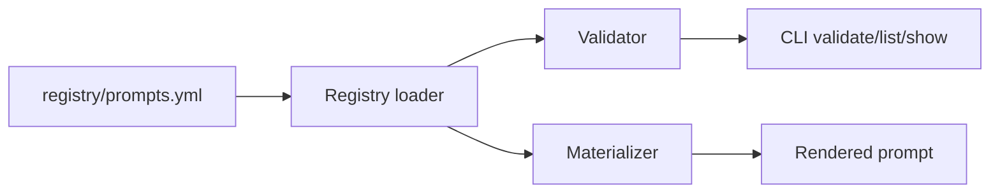

# Architecture

`prompt-registry` is a local Ruby tool for keeping canonical engineering prompts versioned, discoverable, and testable.

## Components

- `registry/prompts.yml`: the authoritative manifest for every prompt template.
- `prompts/**/v1.md`: the versioned Markdown templates themselves.
- `Registry`: loads manifest data and resolves prompt entries.
- `Validator`: proves that every manifest entry points to a file and that every declared placeholder is present.
- `Materializer`: replaces `{{placeholder}}` tokens with runtime values.
- `CLI`: exposes `list`, `show`, `materialize`, and `validate`.

## Data Flow

## Boundary Choices

- The manifest is authoritative so prompt metadata stays diffable in one file.
- Markdown is the prompt format because it is readable by humans and directly consumable by models.
- Placeholder substitution is deliberately simple. The registry owns prompt truth, not workflow orchestration.
- The repository is local-first. There is no gateway, database, or remote serving layer because prompt contract quality is the higher-leverage dependency right now.

## Extension Path

If the registry proves useful, the next steps should be:

1. add `v2` prompts only when a real task pattern changes
2. add stronger schema validation if prompt metadata grows
3. add a gateway only after prompt versions become stable governance units
